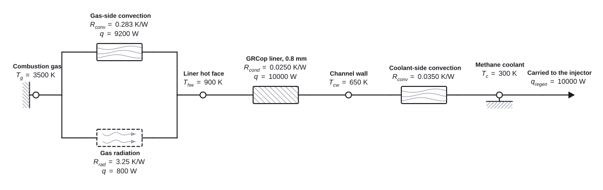

<h1 align="center">ThermoDraw</h1>

<p align="center">Thermal network diagrams for Python. Emits SVG. No runtime dependencies.</p>

<p align="center">
  <a href="https://pypi.org/project/thermodraw/"></a>
  <a href="https://github.com/pcetner/ThermoDraw/actions/workflows/ci.yml"></a>
  <a href="https://pypi.org/project/thermodraw/"></a>
  <a href="LICENSE"></a>
</p>

<p align="center">
  <picture>
    <source media="(prefers-color-scheme: dark)" srcset="docs/assets/raptor-dark.svg">
    
  </picture>
</p>

<p align="center"><em>One square centimetre of a regeneratively cooled methalox throat wall at Raptor-class conditions, from combustion gas to coolant. The numbers are estimates from public figures, not SpaceX data, and <code>thermodraw check --physics</code> confirms they agree with each other.</em></p>

That file is [`examples/raptor.json`](examples/raptor.json). It holds no
coordinates: the solver placed every node. The sources and the arithmetic
are in [`examples/raptor.md`](examples/raptor.md).

## Install

```bash
pip install thermodraw
```

Python 3.10 or later. No dependencies. From a checkout, `pip install -e .`.

## Use

A diagram is data. Write it, or have a model write it, then render it:

```python
from thermodraw import Diagram, save

d = Diagram.from_json(open("examples/raptor.json", encoding="utf-8").read())

save(d.svg(), "web.svg")          # follows the reader's light and dark setting
save(d.svg("light"), "word.svg")  # colours and fonts resolved, for Word and slides
```

Or build it in Python:

```python
from thermodraw import DiagramBuilder

d = (DiagramBuilder(R="K/W", T="°C", P="W")
     .node("j", "Junction", 112, at=(200, 150), sub="j")
     .node("c", "Case", 78, at=(424, 150), sub="c")
     .branch("j", "c", "cond", "Die attach", "0.35")
     .source("j", "diss", "Switching loss", 45, sub="d"))
open("out.svg", "w", encoding="utf-8").write(d.svg("light"))
```

A notebook shows a `Diagram` as its drawing. If your readers know circuit
notation, `d.svg(notation="zigzags")` draws every resistance as a zigzag
instead of a textured box, and nothing else moves. A PNG needs a rasteriser,
which the library does not carry:

```python
import cairosvg
cairosvg.svg2png(bytestring=d.svg("light").encode("utf-8"), write_to="out.png")
```

## Check

Find out whether the drawing is any good without opening it:

```bash
thermodraw check --physics examples/raptor.json
```

```
examples/raptor.json: 9 labels placed, 0 errors, 0 warnings, 0 notes
```

Twelve checks look at how the drawing reads: text over text, a label pushed
away from the thing it names, a wire through a symbol, ink off the page.
`--physics` asks a different question, whether the numbers agree with each
other at every node. Change the gas-side convection in that file from 0.283
to 0.20 and run it again:

```
examples/raptor.json: 9 labels placed, 0 errors, 2 warnings, 0 notes
warning: [node-does-not-balance] node 'hw': 1.38e+04 W arrives and 1e+04 W
         leaves at the stated values: 1.3e+04 W in by branch 0 gas->hw
         (2.6e+03 K over 0.2 K/W); 800 W in by branch 1 gas->hw (2.6e+03 K
         over 3.25 K/W); 1e+04 W out by branch 2 hw->cw (250 K over
         0.025 K/W)
         -> check the values. If one box stands for several identical paths,
         give it `count` and `arrangement`; if a temperature is a limit
         rather than a result, or a flow is a capacity rather than a load,
         say so in the `label`
warning: [rate-does-not-match] branch 0 gas->hw says it carries 9.2e+03 W,
         and its ends imply 1.3e+04 W (2.6e+03 K over 0.2 K/W)
         -> one of `rate`, `value` or an end temperature is wrong
```

Every finding names the schema field that fixes it. Exit 0 is clean, 1 is a
warning or an error, and 2 means the file could not be read. A note is
advice and does not fail the run unless you pass `--strict`. `--physics` is
opt-in, because a sketch with placeholder numbers is a diagram too.

## Describe

A clean report is not the same as the right diagram, so there is a second
question:

```bash
thermodraw describe examples/raptor.json
```

```
examples/raptor.json: canvas 1119 x 354, 9 labels

placements: ground x2, node x4, symbol/cond x1, symbol/conv x2,
            symbol/flow x1, symbol/rad x1, wire x11
```

Then every node with its kind and place, and every label with the side it
went to. `check` grades the drawing; `describe` says what is in it.

Three more commands. `thermodraw render` writes the SVG. `thermodraw page`
writes the same drawing as a self-contained HTML page with its controls.
`thermodraw solve` writes the diagram back with every node placed, so you
can write a network without coordinates, solve it, and move only what you
would have put elsewhere.

Or draw one by hand. The [editor](https://pcetner.github.io/ThermoDraw/editor/)
runs this library in the browser: drag symbols on, connect nodes, edit
values, and see the findings as you go. Files stay in your browser, and a
link carries a diagram to anyone.

## The symbols

<p align="center">
  <picture>
    <source media="(prefers-color-scheme: dark)" srcset="docs/assets/vocabulary-dark.svg">
    
  </picture>
</p>

<p align="center"><em>Eighteen symbols. The mechanism is carried by the interior texture, not by the outline.</em></p>

The [symbol dictionary](https://pcetner.github.io/ThermoDraw/dictionary.html)
says what each one means and when to use it. The
[symbol reference](https://pcetner.github.io/ThermoDraw/symbol-reference.html)
shows every one at eight orientations, with the reasoning.

## Where this sits

Graphviz, D2 and Mermaid will place an arbitrary network for you, and
schemdraw will draw it in circuit notation. None of them says which
mechanism each path is, in a notation a thermal engineer reads, and none
says whether the drawing reads well or whether its numbers agree. That is
what this is for. The parts that are ThermoDraw's own are the
twenty-symbol vocabulary, the label solver, `check`, `describe` and
`--physics`. Coordinates are solved for a chain of nodes, which is what
nearly every network in this notation is. Anything else still takes its
coordinates from you, and says so by name.

If you want circuit notation, use schemdraw. If you want a graph laid out
and do not care what the boxes mean, use Graphviz. If you want a thermal
network that a reviewer can read from the picture, this.

## Docs

- [The site](https://pcetner.github.io/ThermoDraw/): the
  [editor](https://pcetner.github.io/ThermoDraw/editor/), the symbol
  dictionary, the symbol reference, and the
  [gallery](https://pcetner.github.io/ThermoDraw/gallery/) of fifteen
  networks drawn by agents from the schema alone.
- [`docs/schema.md`](docs/schema.md): the whole format, written to be pasted
  into a prompt.
- [`docs/stability.md`](docs/stability.md): what 1.0 promises to keep, and
  what it does not.
- [`CHANGELOG.md`](CHANGELOG.md): every release.
- [`CLAUDE.md`](CLAUDE.md): the decisions, one line each, and
  [`docs/design-record.md`](docs/design-record.md): the argument behind each.

MIT. The bundled subset of IBM Plex Sans is
[OFL-1.1](src/thermodraw/fonts/OFL.txt).
