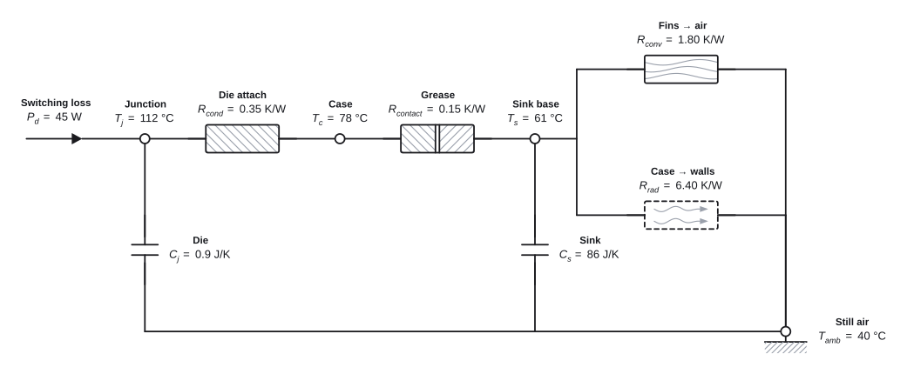
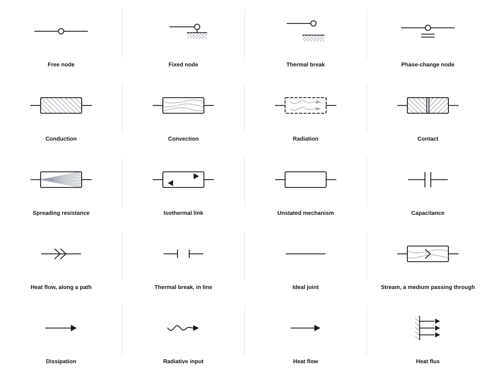
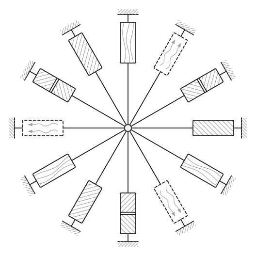

<h1 align="center">ThermoDraw</h1>

<p align="center">
  Thermal network diagrams for Python.<br>
  Emits SVG. No runtime dependencies.
</p>

<p align="center">
  <picture>
    <source media="(prefers-color-scheme: dark)" srcset="docs/assets/hero-dark.svg">
    
  </picture>
</p>

<p align="center"><sub>Junction to still air — conduction, contact, then convection and radiation in parallel.</sub></p>

<br>

<p align="center">
  <picture>
    <source media="(prefers-color-scheme: dark)" srcset="docs/assets/vocabulary-dark.svg">
    
  </picture>
</p>

<p align="center"><sub>Eighteen symbols. Mechanism is carried by the interior texture, not by the outline.</sub></p>

<br>

<p align="center">
  <picture>
    <source media="(prefers-color-scheme: dark)" srcset="docs/assets/rosette-dark.svg">
    
  </picture>
</p>

<p align="center"><sub>The four box textures at twelve angles. A texture belongs to its block and turns with it.</sub></p>

<br>

## Install

```bash
pip install -e .
```

## Use

A diagram is data. Write it, or have a model write it, and render it:

```python
from thermodraw import Diagram, layout, render, save, theme

d = Diagram.from_json(open("hero.json").read())
svg = render(layout(d))

save(theme.with_variables(svg), "web.svg")   # follows the reader's light/dark
save(theme.bake(svg, "light"), "word.svg")   # colours and font resolved
```

Or build it in Python:

```python
from thermodraw import DiagramBuilder

d = (DiagramBuilder(R="K/W", T="°C", P="W")
     .node("j", "Junction", 112, at=(200, 150), sub="j")
     .node("c", "Case", 78, at=(424, 150), sub="c")
     .branch("j", "c", "cond", "Die attach", "0.35")
     .source("j", "diss", "Switching loss", 45, sub="d"))
open("out.svg", "w", encoding="utf-8").write(d.svg("light"))
```

Then find out whether it is any good, without opening it:

```bash
thermodraw check hero.json
```

```
hero.json: 11 labels placed, 0 errors, 0 warnings, 1 note
note: [parallel-pair-same-side] branch 2 s->amb and branch 3 s->amb run
      between the same two nodes and both labels went to the same side
      -> set `side` to "down" on the lower of the two
```

Twelve checks on how the drawing reads — text over text, a label shoved out
past the thing it names, a wire through a symbol, ink off the page. Exit 0
clean, 1 on a warning or an error, 2 when the file could not be read. A note
is advice and does not fail the run — the report above exits 0 — unless you
pass `--strict`. Every finding names the schema field that fixes it.

`--physics` asks a different question: whether the numbers agree with each
other — what arrives at each node against what its temperatures and
resistances say leaves. It is opt-in, because a sketch with placeholder
numbers is a diagram too; ask for it when you believe the numbers.

A clean report is not the same as the right diagram, so there is a second
question:

```bash
thermodraw describe hero.json
```

```
hero.json: canvas 1042 x 431, 11 labels

placements: ground x1, node x4, symbol/cap x2, symbol/cond x1,
            symbol/contact x1, symbol/conv x1, symbol/diss x1, symbol/rad x1,
            wire x15
```

...then every node with its kind and place, and every label with the direction
it went. `check` grades the drawing; this says what is in it.
`thermodraw render` writes the SVG. `thermodraw page` writes the same drawing
as a self-contained HTML page with its controls — a repeated group of sixteen
draws two and an ellipsis, and the page lets a reader expand it without
anything being rebuilt. All four work as `python -m thermodraw` from a
checkout.

```bash
python examples/render_demo.py       # the three images above
python examples/render_reference.py  # every symbol at every 45°
pytest
```

## Where this sits

Drawing schematics from Python is not an empty field, and laying out a graph
is a solved problem — Graphviz, D2 and Mermaid will place an arbitrary network
for you, and schemdraw will draw it in circuit notation with a resistor
zigzag for every path. What none of them does is the thing this exists for:
say *which mechanism* each path is, in a notation a thermal engineer reads,
and then say whether the drawing reads well and whether its numbers agree
with each other.

So the parts that are ThermoDraw's own are the eighteen-symbol vocabulary and
the rule behind it, the label solver, `check`, `describe` and `--physics`.
The part that is not yet built — solving for node coordinates — is the part
most likely to be someone else's solved problem, and the design record says
which of the twelve checks a solver must satisfy, which it minimises, and which
it makes redundant.

If you want circuit notation, use schemdraw. If you want a graph laid out and
do not care what the boxes mean, use Graphviz. If you want a thermal network
that a reviewer can read from the picture, this.

## More

[`docs/schema.md`](docs/schema.md) — the whole format, written to be pasted into a prompt.
[`docs/symbol-reference.html`](docs/symbol-reference.html) — every symbol at eight orientations, with the reasoning.
[`CLAUDE.md`](CLAUDE.md) — the decisions, one line each.
[`docs/design-record.md`](docs/design-record.md) — the argument behind each one.

Alpha. The symbol vocabulary is settled; labels, wire runs and canvas size are
solved for you, and `thermodraw check` reports what a reader would notice.
Node coordinates are still yours to supply; solving for those is the network
layer, which changes one stage and nothing in the schema.

MIT. The bundled subset of IBM Plex Sans is [OFL-1.1](src/thermodraw/fonts/OFL.txt).
